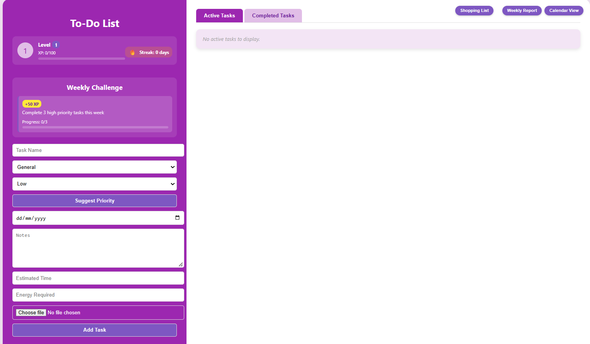

<h1 align="center">To-Do List Website</h1>
<h3 align="center">A gamified task manager built with HTML, CSS and JavaScript</h3>

  
  
  

<h2>Overview</h2>

A to-do list website for planning and tracking tasks, with a calendar view, voice input and gamification features (XP, levels, streaks and weekly challenges) to encourage consistent use. Built from scratch with no frameworks to practise front-end fundamentals.

<h2>Demo</h2>

  <a href="https://iqrah01.github.io/To-Do-List-Website/">View the live site</a>

  

<h2>Features</h2>
<h3>Task Management</h3>
<ul>
    <li>Add tasks with a category, priority, due date, notes, estimated time, energy required and an optional file attachment</li>
    <li>Edit, complete, delete and restore tasks</li>
    <li>Separate tabs for active and completed tasks</li>
    <li>Filter by category and sort by priority or due date</li>
    <li>Overdue tasks are flagged with a marker</li>
</ul>
<h3>Views</h3>
<ul>
    <li>Switch between list view and a monthly calendar view</li>
    <li>Calendar tasks are colour-coded by priority, with hover tooltips showing task details</li>
</ul>
<h3>Input Helpers</h3>
<ul>
    <li>Voice input for the task name and due date using the Web Speech API</li>
    <li>Keyword-based priority suggestion that flags urgent wording such as "deadline" or "exam"</li>
</ul>
<h3>Gamification</h3>
<ul>
    <li>Earn XP for completing tasks, with bonus XP for higher priority</li>
    <li>Level up with a progress bar, and unlock bronze, silver and gold medal avatars</li>
    <li>Daily streak counter that resets if a day is missed</li>
    <li>Weekly challenges that alternate each week, with XP rewards to claim</li>
</ul>
<h3>Extras</h3>
<ul>
    <li>Weekly report of tasks completed in the last 7 days</li>
    <li>Shopping list generated from tasks in the groceries category</li>
    <li>Download all tasks as a text file</li>
    <li>Data saved in the browser using local storage</li>
</ul>
<h2>Built With</h2>
<ul>
    <li><strong>HTML:</strong> page structure</li>
    <li><strong>CSS:</strong> styling, layout and notification animations</li>
    <li><strong>JavaScript:</strong> task logic, calendar rendering, gamification and local storage</li>
</ul>
<h2>What I Learned</h2>
<ul>
    <li>Updating the page dynamically by building and rendering HTML from JavaScript data</li>
    <li>Saving and loading data with local storage and JSON</li>
    <li>Working with dates to build a calendar and track streaks and weekly resets</li>
    <li>Using browser APIs, including speech recognition, FileReader and Blob downloads</li>
    <li>Designing simple progression systems (XP, levels and challenges)</li>
</ul>
<h2>Future Improvements</h2>
<ul>
    <li>Replace the alert pop-ups for the weekly report and shopping list with on-page displays</li>
    <li>Add a real AI or machine learning model for priority suggestions</li>
    <li>Improve the mobile layout</li>
    <li>Store attachments more efficiently to avoid local storage size limits</li>
</ul>
<h2>Repository Contents</h2>
<ul>
    <li><code>index.html</code>: page structure</li>
    <li><code>style.css</code>: styling</li>
    <li><code>script.js</code>: functionality</li>
</ul>
<h2>Connect With Me</h2>

  

